<p align="center">
  
</p>

<p align="center">
  <a href="https://github.com/gongqiankun/AgentFleet/actions/workflows/ci.yml"></a>
  <a href="LICENSE"></a>
  
</p>

<p align="center">
  English · <a href="README.zh-CN.md">简体中文</a><br><br>
  <a href="#self-host">Get started</a> · <a href="#built-for-your-native-sessions">Features</a> · <a href="#how-it-compares-to-codex">Compare with Codex</a> · <a href="#our-vision">Vision</a> · <a href="CONTRIBUTING.md">Contribute</a> · <a href="SECURITY.md">Security</a>
</p>

<p align="center"><strong>Pick up your Codex work from any browser.</strong><br>
Follow conversations across your machines. Continue the same native session.<br>
Keep execution in your own environment.</p>

<p align="center">A self-hosted operations console for Codex CLI across Linux servers and personal computers.<br>Manage native sessions, send files and images, use installed plugin skills, and track usage from one English or Chinese web interface.</p>

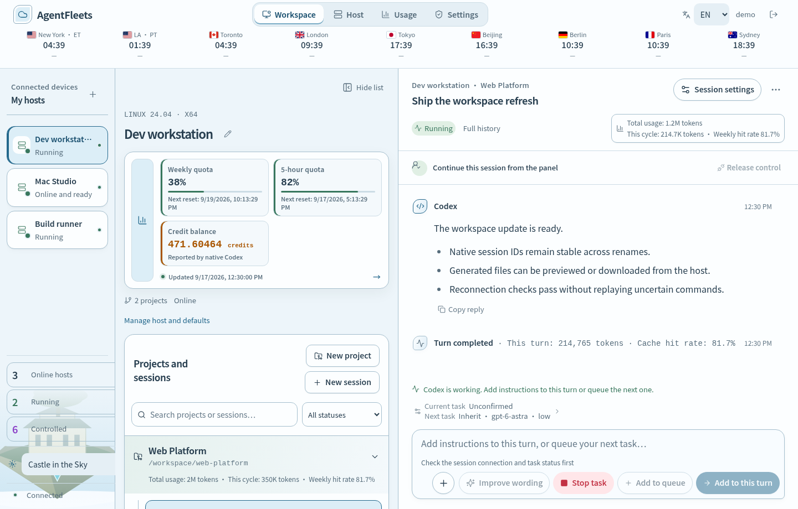

<p align="center"><sub>Actual interface with synthetic demo data. No production accounts, hosts, or conversations are shown.</sub></p>

## One console for Codex across your machines

Running Codex on several machines creates a management task of its own: finding the right session, checking which jobs are still running, returning to finished results, and keeping track of settings and usage. **AgentFleets brings those everyday operations into one graphical workspace.**

Think of each enrolled host as a place where Codex executes work, and AgentFleets as the console you use to supervise it. This is particularly useful for **headless Linux servers**: the server runs Codex and the Agent, while you interact through a browser on another computer. No graphical desktop is required on the execution host. Once enrolled, hosts connect outward to your control plane; routine session management does not require opening an SSH terminal for each machine.

| Available today | What it makes easier |
| --- | --- |
| **Graphical Codex session management** | Browse hosts, projects, and conversations; continue native sessions; adjust model settings and execution permissions in the panel. |
| **Files, folders, and images sent to a remote session** | Use one attachment menu to paste images or upload bounded files and folders. AgentFleets safely stages files on the selected host and sends native Codex references. |
| **Native goals, Plan mode, and plugin skills** | Set a persistent session goal, switch the next turn to a host-advertised collaboration mode, and select skills from installed, enabled Codex plugins. |
| **Host files in conversation results** | Open or download files linked by Codex directly from the message. Bytes stream on demand from the bound host and remain limited to that session's registered project. |
| **An overview across multiple hosts** | Follow running work, return to completed-but-controlled sessions, queue follow-up messages, and inspect recorded tokens and reported account quota. |
| **Switchable interface themes** | Choose from 17 themes, with Castle in the Sky as the default for new browsers. Five Chinese classics join illustrated themes with coordinated messages, Markdown, code blocks and composers. |

### Visual context, even on a headless server

For example, paste a screenshot of a broken page on your laptop, select the session on your Linux host, and ask Codex to investigate the project there. The current composer accepts pasted **PNG, JPEG, and WebP images, up to four per message**, with previews and automatic resizing/compression. Submission requires a host runtime and model that support image input.

Codex CLI already supports image and local-path inputs; AgentFleets makes those workflows accessible through a browser across enrolled hosts. See the [official Codex CLI documentation](https://learn.chatgpt.com/docs/codex/cli). The `+` menu accepts images and up to 32 files, with a 4 MB per-file and 8 MB combined limit, or a folder while preserving its relative structure. Supported inputs include structurally checked PDF and macro-free XLSX files, UTF-8 text, common source code, configuration, and structured data. Validation runs in the browser, control plane, and host Agent; changing a binary file's extension does not bypass it. Other Office formats, archives, audio, video, and executables are rejected. Accepted files are staged under the selected project and passed to Codex as native path references. Files that Codex links in a reply can also be previewed or downloaded from the execution host on demand.

## Say what you need, even without the terminology

You should not have to know the exact technical term before asking for help. **Writing assistance helps turn what you mean into a request you can review and send**, without leaving the conversation.

- **Find the words as you type.** Chinese and English term suggestions cover programming, agents, office work, engineering, games, video editing, philosophy and cognition. Recall a name such as “ripple edit” or “metacognition” without interrupting your work to search for it.
- **Start in everyday language.** “Play the next shot audio before cutting to its picture” can surface a suggestion for an audio lead-in. “Am I only looking for evidence supporting my own view” can prompt a check for confirmation bias. Suggestions help frame the question; they do not decide the answer for you.
- **Improve wording when you want to.** Click **Improve wording** to request one concise rewrite that aims to preserve your intent and constraints. AI-assisted results are labeled, and you choose whether to apply, edit or ignore them.
- **Keep familiar language close at hand.** Suitable terms and explicit rewrites from synced conversations are added automatically, so you do not have to maintain a dictionary or approve entries one by one.
- **Use it comfortably on a phone or desktop.** Tap suggestions on mobile or use Tab for input completion on desktop. Longer wording suggestions show up to four lines on mobile, keeping the composer usable.

Choose your writing assistance defaults once in Settings, then adjust individual conversations when needed. Basic completion and local wording suggestions work without an external AI account; the optional **Improve wording** action uses the provider you configure.

The aim is fewer interruptions and clearer requests for both specialists and people working outside their expertise. Coverage continues to grow; a suggestion is an aid to expression, not a guarantee that every phrase is understood.

### Writing assistance in action

Type part of a term to find the name you need, then choose a suggestion without leaving the conversation.

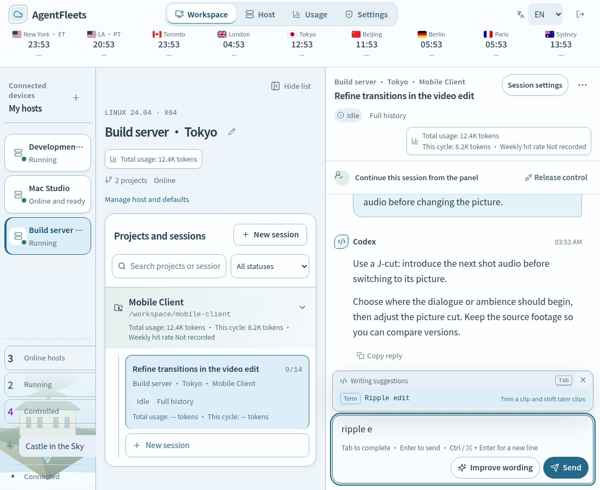

| Refine your wording on mobile | Choose the help you want |
| --- | --- |
| 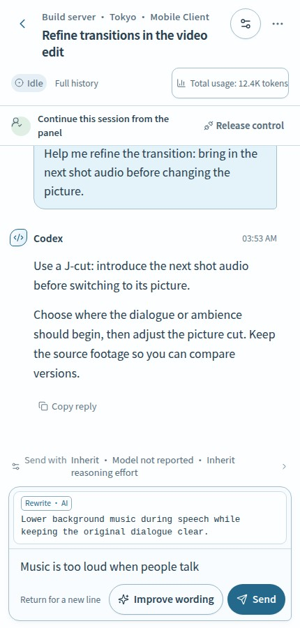 | 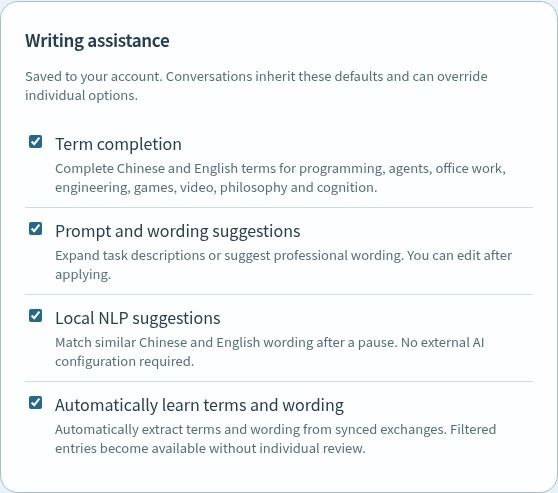 |
| **Improve wording** offers a concise alternative. Read it before applying it to your draft. | Set your defaults once. Individual conversations can inherit them or use different choices. |

*Real interface with fictional conversations and simulated suggestions. No production account data or live model responses are shown.*

## Our vision

**Every computer. Any operating system. Codex as the interface. AgentFleets in control.**

We want Codex to become the single entry point for operating every computer—from writing code and managing files to running applications and maintaining systems. AgentFleets would connect those computers into one workspace, where you can direct work, follow progress, and manage access without switching between machines or learning a different workflow for each operating system.

Codex acts on each computer. AgentFleets coordinates the fleet. You decide what they can do.

Today, AgentFleets manages native Codex sessions on supported Linux, macOS, and Windows hosts. The next horizon is broader operations through Codex:

- **A consistent operations entry point:** extend the workflow from individual coding sessions toward everyday application and system maintenance across operating systems.
- **Coordinated work across hosts:** move toward explicit multi-host workflows with task dependencies and progress tracking. Today's panel manages sessions on each host; it does not automatically schedule one job across the fleet or migrate its conversation and Git state.
- **Richer remote inputs:** expand beyond the current bounded file, folder, image, goal, Plan mode, and installed-plugin workflows while retaining host-side validation.

These are future directions, not shipped features or a delivery schedule. Universal operating-system support and a complete interface for every computer operation remain goals. AgentFleets currently provides Codex session operations, not a general server monitoring, patch management, or multi-user access-control system.

## Built for your native sessions

<table>
<tr>
<td width="33%" valign="top"><h3>Find active work fast</h3>Click Running, Controlled, or Online hosts, then jump straight to the session or machine you need. Skip browsing project trees across your fleet.</td>
<td width="33%" valign="top"><h3>Continue where you left off</h3>Take control, send a message, and release back to the host. Rename a session without changing its native identity.</td>
<td width="33%" valign="top"><h3>Keep work moving</h3>Follow streaming output, add instructions to a running turn, or queue the next message. Choose execution permissions per session.</td>
</tr>
<tr>
<td valign="top"><h3>Recover deliberately</h3>Unknown outcomes freeze writes. Verify the host and unfreeze manually, with no automatic replay of uncertain actions.</td>
<td valign="top"><h3>See what you store</h3>Inspect staged files by type and session. Preview supported cleanup before confirming it, with conversation text and native session identity preserved.</td>
<td valign="top"><h3>Keep your model preferences</h3>Inherit Codex model and reasoning-effort settings, set host defaults once, and override individual sessions when needed. Avoid configuring every conversation from scratch.</td>
</tr>
<tr>
<td valign="top"><h3>Read native account limits</h3>Show weekly and five-hour quota windows plus the current credit balance reported by Codex on the host.</td>
<td valign="top"><h3>Trace recorded token cost</h3>Compare total and current-cycle usage by project and session, including per-turn and weekly cache hit rates.</td>
<td valign="top"><h3>Add richer turn context</h3>Attach supported files, folders and images; select installed plugins with <code>+</code> or <code>@</code>; keep goals and Plan mode visible in the composer.</td>
</tr>
</table>

### Jump straight to active work

The sidebar counts are shortcuts: click a category, then select a host or session to open it directly across your fleet. No need to remember which project contains a conversation or expand hosts and projects one by one.

| Shortcut | What you can reach |
| --- | --- |
| **Running** | Sessions with an active turn, including work waiting for your answer or approval |
| **Controlled** | Sessions still under AgentFleets control, including completed tasks whose results you want to review or follow up on |
| **Online hosts** | Connected hosts, with direct access to their workspace |

**Use Running to follow progress and Controlled to return to results.** When a turn finishes, its session leaves Running. As long as control has not been released, you can still find it under Controlled to review the output or send the next instruction without browsing hosts and projects again. Controlled also includes active sessions; it is not a completed-only filter.

Counts and open lists update as reported state changes. **Controlled means currently controlled, not recently viewed or previously controlled**; released sessions are not a takeover-history list. This workflow is especially useful when several tasks are spread across multiple hosts and projects.

### Model and reasoning settings that follow your workflow

The model shortcut above the composer shows saved model settings and reasoning effort. Draft changes and failed saves do not update the shortcut or send settings; running tasks retain their current configuration.

Keep using Codex's own configuration when no panel override is set. Or save host defaults once and make exceptions for a particular session. Existing project defaults participate in the same precedence:

**Session settings → project settings → host defaults → Codex's own configuration** (highest priority first).

For example, keep a host's everyday model and reasoning effort as its default, then give one demanding session a different supported model or deeper reasoning. Clear that session's override to return to the applicable defaults. Where the host runtime supports them, the panel also exposes plan/execution mode, service tier, and communication style.

The save button tracks the selected target scope. It is disabled when the form already matches the saved host, project, or session configuration; editing a value enables it, and a successful save or reverting to the saved values disables it again. This makes pending configuration changes visible before the next send.

- **Fewer repeated choices:** reuse saved settings across sessions instead of selecting the model and reasoning effort every time.
- **Visible configuration:** inspect the selected source, recently observed runtime values, and the settings last accepted by the host. A saved preference is not proof of the provider's final model choice.
- **Controlled changes:** saved defaults are used for subsequent sends; they do not rewrite the host's `config.toml` or change a turn already running. Choices are validated against the host's reported capabilities.

Together with direct access to running and completed-but-controlled sessions, native-session continuity, message queues, and explicit recovery, these are the workflows AgentFleets focuses on making easier. They are practical product strengths, not claims that other Codex clients lack similar features.

### Keep long native sessions usable

AgentFleets continues the same native Codex thread, including its history and identity. Codex performs its own automatic context management as a conversation grows. When you want explicit control, the session tools can request native context compaction without creating a replacement conversation. The panel labels the request and its result separately because acceptance does not mean compaction has already finished.

The composer keeps the active goal, Plan mode, installed plugin selection, model and reasoning effort close to the message. Plugins can be selected from the `+` menu or found by typing `@`; only capabilities advertised by the connected host are offered.

### Themes for different working environments

Choose from **17 themes**, with Castle in the Sky as the default for new browsers. Five Chinese classics join Cyberpunk, The Matrix, Frozen and other illustrated themes. Each coordinates scene artwork, component borders, message bubbles, Markdown tables and quotations, code blocks and the composer.

On desktop, use the theme control below **Controlled** in the left sidebar. On narrow screens, open the navigation menu; the full theme selector is also available in Settings. The layout adapts to mobile widths, and the selected theme is remembered in the current browser.

All screenshots use fictional demo data. Browse **[all 17 desktop themes and 6 mobile previews](docs/themes.md)**.

| **Havoc in Heaven**<br>[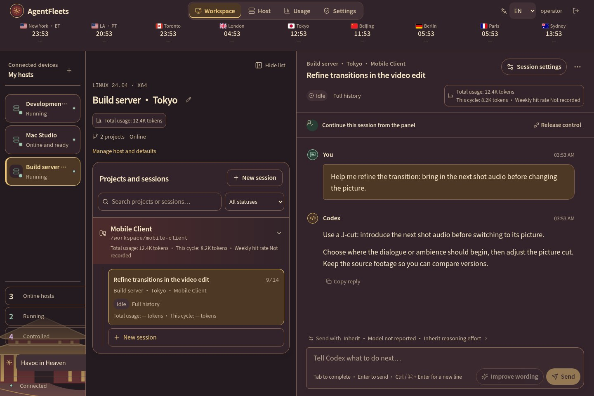](docs/themes.md) | **A Thousand Li of Rivers and Mountains**<br>[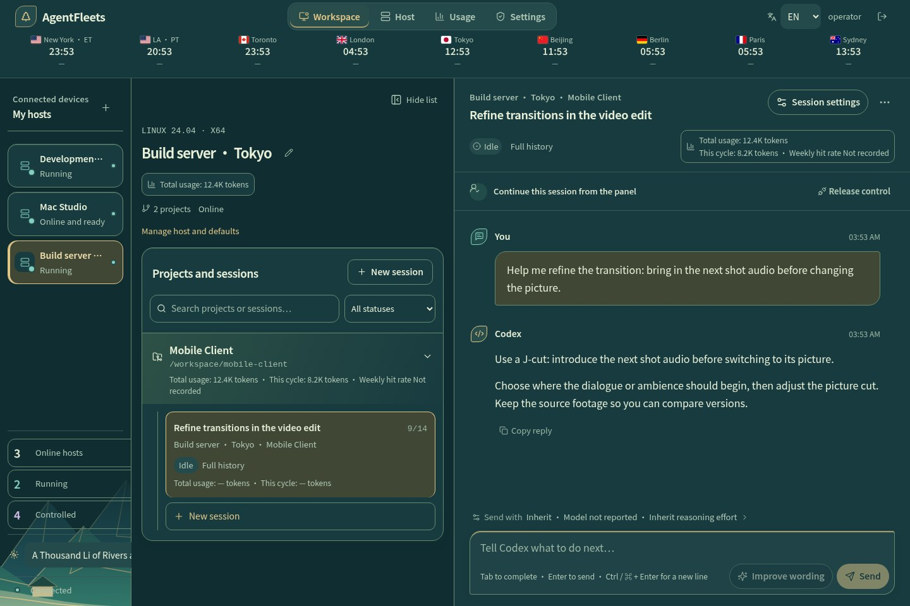](docs/themes.md) |
| --- | --- |
| **Legend of the White Snake**<br>[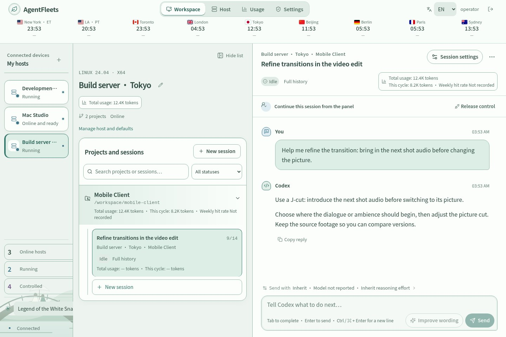](docs/themes.md) | **The Matrix**<br>[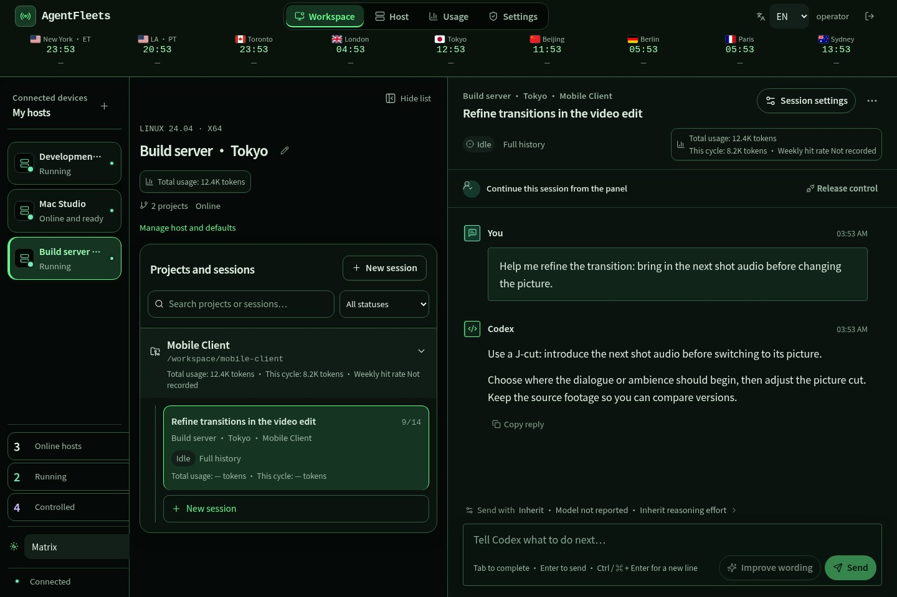](docs/themes.md) |
| **Harry Potter**<br>[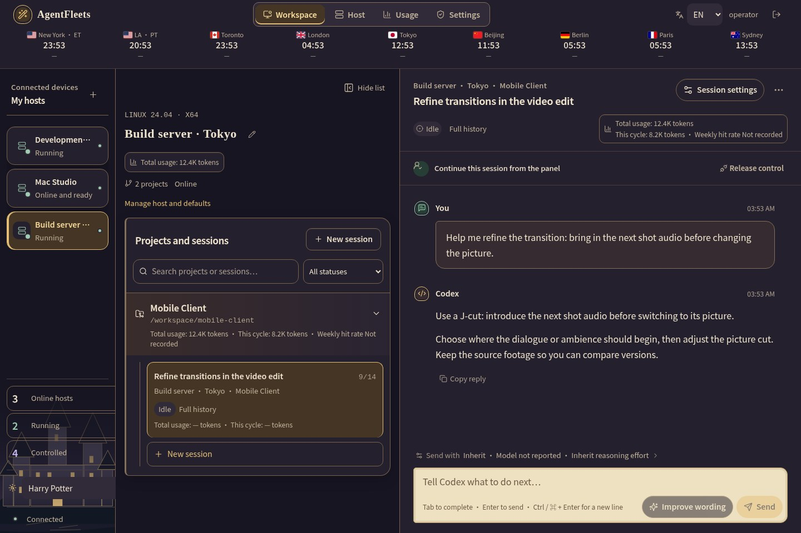](docs/themes.md) | **Peter Rabbit Garden**<br>[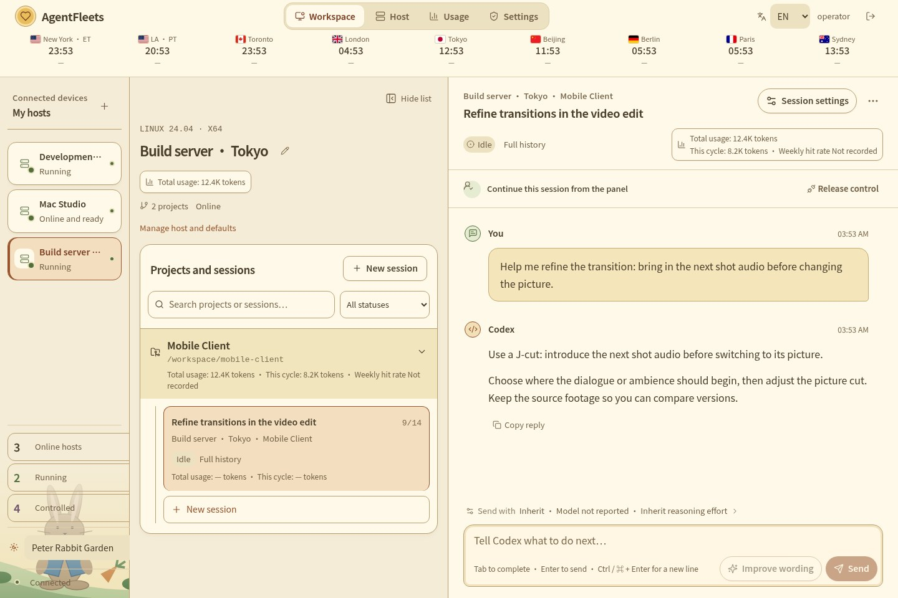](docs/themes.md) |

### Know what is using your quota

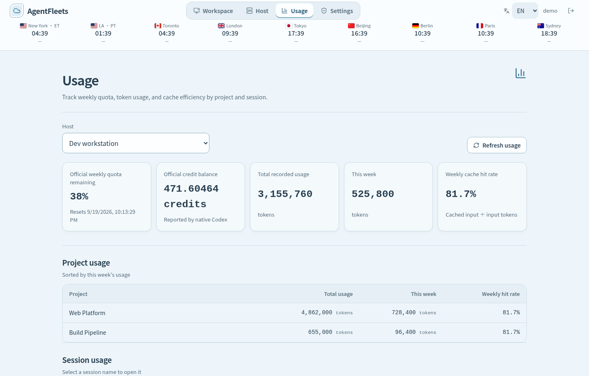

Open **Usage** or the summary on a host, project, or session to see three related views:

- **Official account limits:** weekly and five-hour quota windows, reset times, and the current credit balance, read from native Codex on the host. Hosts that report the same account are deduplicated instead of having their limits added together.
- **Recorded token usage:** total and current weekly-cycle tokens by machine, project, and session. Session timelines also show the tokens used by each completed turn when Codex reports them.
- **Cache efficiency:** per-turn and weekly cache hit rates, calculated as cached input tokens divided by input tokens. Rankings show which projects and sessions account for the recorded usage, with pagination for longer lists.

Quota and credits are shared by a Codex account; project and session figures are recorded observations, not an allocation of the account's official percentage or credit balance. Collection starts with managed-session notifications and does not reconstruct earlier history or standalone CLI work. Missing, partial, and stale data are labeled explicitly. Account limits update from native events, an initial connection query, and manual refresh; the browser reads the stored snapshot without polling every host each minute. See [usage accounting](docs/usage.md) for coverage and counting rules.

*The dashboard above is the real interface populated only with fictional hosts, projects, sessions, quota and credit values.*

## How it compares to Codex

**AgentFleets adds a self-hosted management interface around Codex.** The host's Codex runtime still executes the work; AgentFleets does not supply a model, a subscription, or extra usage quota.

[Codex CLI](https://learn.chatgpt.com/docs/cli) is the terminal interface. The [official desktop app](https://learn.chatgpt.com/docs/app) provides a graphical workspace. AgentFleets focuses on administering enrolled hosts and their native sessions through your own browser-based panel.

| Area | Official desktop Remote Control | AgentFleets |
| --- | --- | --- |
| Access | Supported desktop/mobile apps | Your self-hosted web panel |
| Device identity | Same ChatGPT account **and workspace**, plus device authorization | Independent panel login and one-time host enrollment |
| Connection | Authorized devices connect through the official relay | Agent on each host connects outward to your control plane |
| Continue work | Continue chats and steer active work remotely | Continue native sessions with explicit take-control/release handling |
| Administration | Official app connection settings | Host/project/session overview, queues, manual unfreeze, retention and supported image cleanup |
| Operation | Official client setup | You operate HTTPS, storage, backups and updates |

**How do accounts and authorization differ across these three connection methods?**

- **Official Remote Control pairs devices.** To control your home computer from your laptop, both apps must use the same ChatGPT account and ChatGPT workspace—not a project folder. Enable remote access on the host and authorize the device pairing. Signing in alone does not grant control.
- **Official SSH connects to projects on a server.** To use a Linux development server, you need SSH login access and Codex installed and authenticated there, then add a remote project in the desktop app. This uses SSH login rather than device pairing; the official SSH setup does not list matching ChatGPT accounts and workspaces as a requirement. See the [official remote connection guide](https://learn.chatgpt.com/docs/remote-connections).
- **AgentFleets enrolls hosts in your own web panel.** Install an Agent on each host and pair it using a one-time credential issued by the panel. The panel account manages hosts; each host's Codex account runs its tasks. Those Codex accounts can differ from each other and from the panel email, but every host needs valid Codex authentication and permissions.

AgentFleets currently uses one administrator account. Enrolling multiple hosts does not share Codex accounts, pool quotas, or provide multi-user team permissions.

Use the official app if its remote workflow meets your needs. Choose AgentFleets when you want to operate and customize your own multi-host web panel. Features overlap: remote continuation is not exclusive to AgentFleets. AgentFleets controls sessions where they live; it does not currently migrate a conversation and its Git state between hosts. Release its writer before opening that same native session in another client.

## Self-host

You need Docker with Compose, an HTTPS reverse proxy, and hosts with a supported Codex installation. Source builds download dependencies and platform runtime artifacts, so internet access is required. Host write access depends on operating-system, credential protection, and App Server protocol checks; a version number alone does not guarantee compatibility.

```sh
git clone https://github.com/gongqiankun/AgentFleet.git
cd AgentFleet
cp .env.example .env
```

Edit `.env` before starting:

- Set `ADMIN_EMAIL` to your own address and `ADMIN_PASSWORD` to a unique password of at least 12 characters. There is no preset password.
- Set `PUBLIC_ORIGIN` and `ALLOWED_ORIGINS` to your own HTTPS origin, without a trailing slash.
- Keep `COOKIE_SECURE=true` for HTTPS and `PUBLISH_HOST=127.0.0.1` when the proxy runs on the same host.
- If using forwarded headers, configure `TRUSTED_PROXIES` with only the verified immediate proxy addresses.

```sh
docker compose up -d --build
curl --fail http://127.0.0.1:3215/ready
```

Forward your HTTPS origin to `127.0.0.1:3215`, including WebSocket upgrade support. Open **your own origin**, sign in with the credentials you configured, and use the panel's host enrollment flow. Run the generated one-time installation command on each intended host; do not share enrollment tickets.

For loopback-only evaluation, set both origins to `http://127.0.0.1:3215` and `COOKIE_SECURE=false`. Do not use that configuration for a public deployment.

Compose persists control-plane data and validated runtime releases in named volumes. Back up your configuration and volumes before upgrades; do not use `docker compose down -v` unless you intend to delete them. See [release guidance](docs/web-only-release.md) for updates that preserve existing Agent downloads.

### Connect the AppleFleets iPhone app

AppleFleets can send an Apple Watch workout summary to Codex on an enrolled Linux host and receive structured Xiaohongshu and Douyin copy. It sends distance, duration, pace, heart-rate summary, and kilometer splits; GPS coordinates are excluded.

1. Sign in to AgentFleets and confirm the Linux host is online.
2. Add a project named `iwatch` on that host, using `/root/iwatch` as its host directory.
3. Enable content sync for that project so the final Codex message can return to the phone.
4. Generate a dedicated token on the server:

```sh
openssl rand -hex 32
```

5. Add the resulting 64-character value and the project name to `.env`:

```dotenv
APPLEFLEETS_API_TOKEN=paste-the-64-character-token-here
APPLEFLEETS_PROJECT=iwatch
```

6. Rebuild and restart AgentFleets:

```sh
docker compose up -d --build
curl --fail http://127.0.0.1:3215/ready
```

7. In the AppleFleets iPhone app, enter your HTTPS origin, such as `https://panel.example.com`, and paste the token.
8. Open a workout and tap **Generate with Linux Codex**. A successful run ends with **Copy received**.

Each request creates an isolated AgentFleets session whose title begins with `AppleFleets`. The token can only submit the fixed workout request and read its corresponding result; it does not grant browser administrator access. Generate a new token, update `.env`, and restart the service to revoke a leaked token.

## Worth knowing

<details>
<summary><strong>Session ownership, recovery, and image cleanup</strong></summary>

## Session control and recovery

A native session has one writer. While the panel controls a session, do not open that same session with `codex resume` on the host. Release control in the panel and wait for the host to acknowledge it before resuming locally. To return to the panel, stop the local writer first, then take control again. Renaming changes the title, not the native session ID.

A disconnect or restart can leave an operation's outcome unknown even if a reply is already visible. The panel freezes writes rather than automatically replaying an action. Check the host and native session first, then use the manual unfreeze button. Unfreezing does not prove that the previous operation failed and does not undo it; avoid sending the same action again until you know its outcome.

## Data and images

The control plane stores account and host enrollment data, synchronized conversation content, operation records, and uploaded images. Codex execution and model credentials remain on the host. Protect both the control-plane volumes and host data; this is not a storage-free relay.

The default image quota is 50 MB per host. The host page combines image and uploaded-file cleanup by session. Before deletion, the Agent verifies every staged path, size, content hash, directory member, and symlink boundary. Cleanup removes verified staged files on Linux, macOS, and Windows while preserving text and native session identity. Native-history image cleanup is currently restricted to the validated Linux/Codex adapter and requires Python 3; unsupported or ambiguous data is rejected. Cleanup does not delete provider-side data or independent backups. Native history files may retain their byte length after image removal. Storage size is not a token-usage estimate. See [attachment cleanup](docs/panel-image-cleanup.md).


</details>

<details>
<summary><strong>Development and project structure</strong></summary>

## Development

Use Node.js 24 and npm:

```sh
npm ci --prefix apps/control-plane
npm ci --prefix apps/local-agent
npm ci --prefix apps/web
npm run check
npm test
npm run build
```

| Directory | Purpose |
| --- | --- |
| `apps/control-plane` | Fastify API, authentication, SQLite state, host connections |
| `apps/local-agent` | Host discovery, native session control, execution and recovery |
| `apps/web` | React browser workspace |
| `packaging` | Installers, runtime artifacts and container builds |
| `experiments` | Isolated native-history compatibility tools and tests |

See [contributing](CONTRIBUTING.md), [security reporting](SECURITY.md), and [packaging](packaging/README.md). Changes to session ownership, replay, or native history require focused recovery tests; passing UI tests alone is insufficient.


</details>

---

<p align="center">Built for people who run Codex on their own machines.<br>
<a href="LICENSE">MIT licensed</a> · <a href="THIRD_PARTY_NOTICES.md">Third-party notices</a> · <a href="CONTRIBUTING.md">Contributions welcome</a></p>

<sub>Independent project, not an official OpenAI product. Deploy your own instance and use your own Codex credentials. No shared service or default login is provided.</sub>
