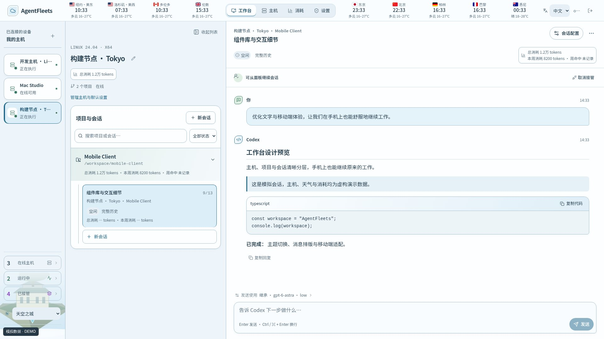
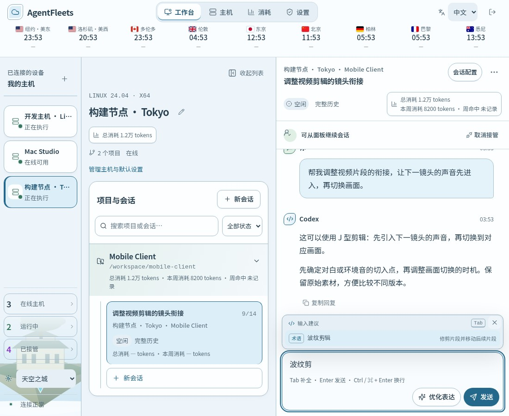
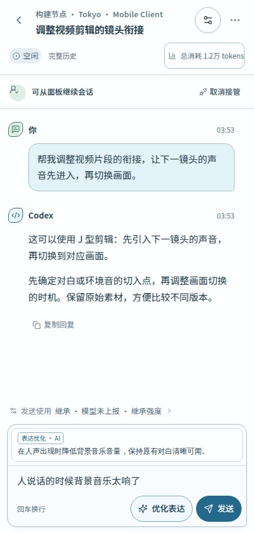
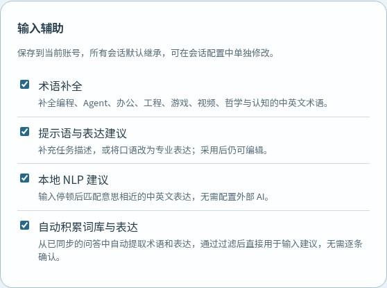
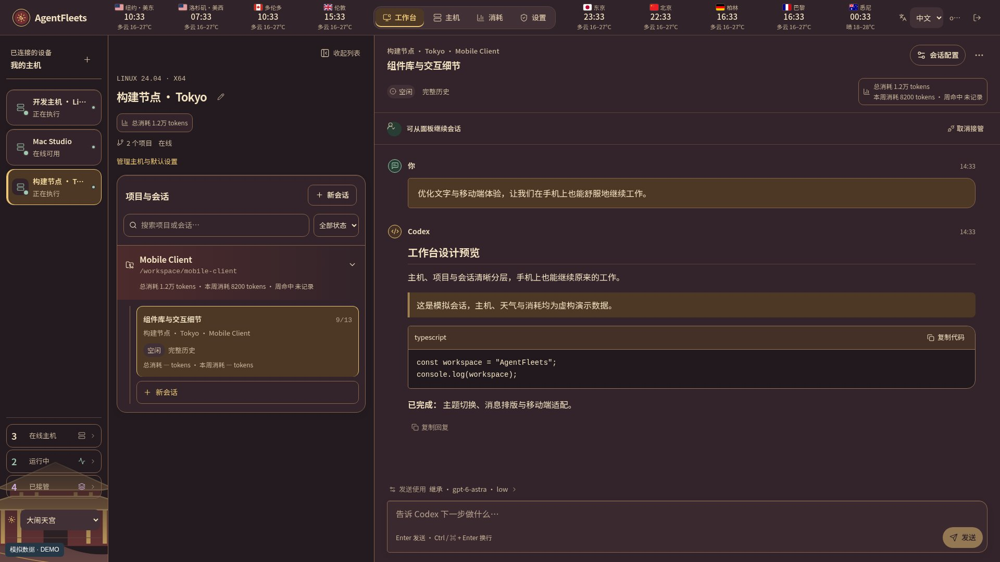
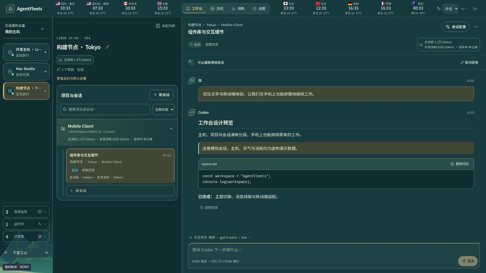
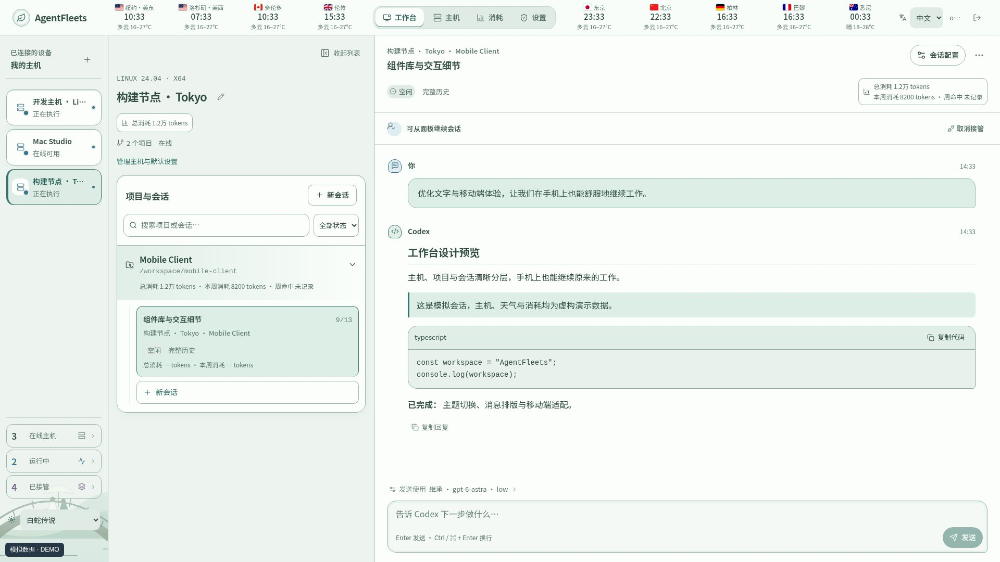
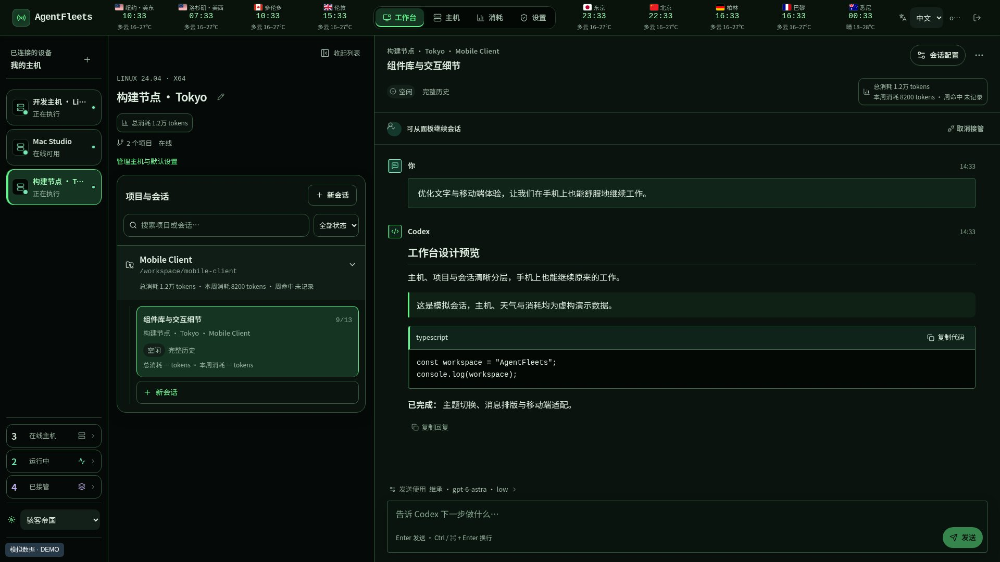
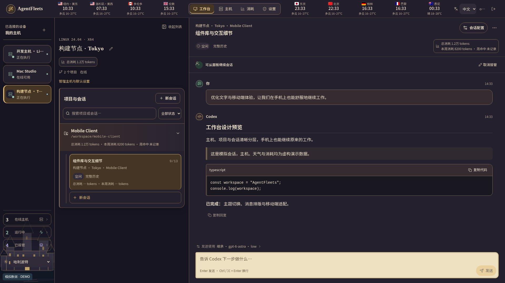
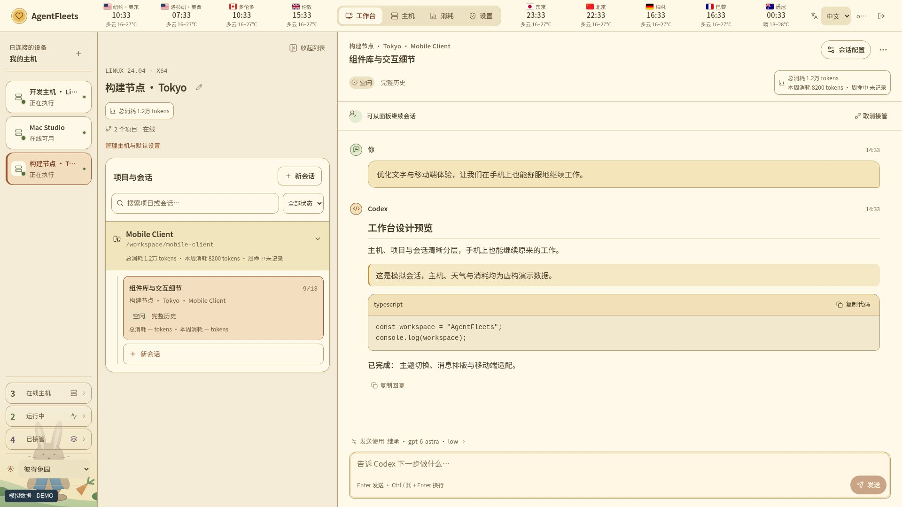

<p align="center">
  
</p>

<p align="center">
  <a href="https://github.com/gongqiankun/AgentFleet/actions/workflows/ci.yml"></a>
  <a href="LICENSE"></a>
  
</p>

<p align="center">
  <a href="README.md">English</a> · 简体中文<br><br>
  <a href="#自行部署">开始使用</a> · <a href="#围绕原生会话构建">功能一览</a> · <a href="#与-codex-有什么区别">与 Codex 对比</a> · <a href="#我们的愿景">愿景</a> · <a href="CONTRIBUTING.md">参与贡献</a> · <a href="SECURITY.md">安全报告</a>
</p>

<p align="center"><strong>打开浏览器，接着做你的 Codex 工作。</strong><br>
统一查看多台主机的对话，继续同一个原生会话。<br>
任务始终在你自己的环境中执行。</p>

<p align="center">面向 Linux 服务器和个人电脑的 Codex CLI 运维控制台，可自行部署。<br>在同一个中英文网页界面中管理原生会话、提交文件与图片、使用已安装插件技能并查看用量。</p>



<p align="center"><sub>真实产品界面，使用虚构演示数据，不包含生产账号、主机或会话。</sub></p>

## 多台主机上的 Codex，一个控制台管理

当多台电脑都运行 Codex 时，管理这些工作本身也需要花时间：会话在哪台主机、哪些任务还在执行、完成的结果去哪里找、模型如何配置、额度消耗在哪里。**AgentFleets 把这些日常操作集中到一个图形化工作台。**

可以把每台接入的主机看作 Codex 执行任务的环境，把 AgentFleets 看作统一管理这些执行环境的控制台。尤其对于**没有桌面环境的 Linux 服务器**，服务器运行 Codex 和 Agent，你在另一台电脑的浏览器里操作即可，执行主机无需安装图形桌面。完成配对后，各主机主动连接控制面，日常会话管理不必逐台打开 SSH 终端。

| 已实现的特色 | 改善的日常体验 |
| --- | --- |
| **Codex 会话图形化管理** | 按主机、项目浏览对话，继续原生会话，在面板调整模型配置与执行权限。 |
| **文件、文件夹和图片提交到远端会话** | 通过同一个附件菜单粘贴图片或上传受限的文件与文件夹；AgentFleets 安全落盘到所选主机，再发送原生 Codex 路径引用。 |
| **原生目标、计划模式和插件技能** | 设置持续生效的会话目标，将下一轮切换为主机支持的协作模式，并从已安装、已启用的 Codex 插件中选择技能。 |
| **直接查看主机任务产物** | Codex 回复中链接的项目文件可从消息里预览或下载；文件按需从对应主机传输，并限定在该会话登记的项目内。 |
| **多主机任务集中查看** | 跟进运行中的任务，找回已完成但仍接管的会话，排队后续消息，查看已记录 token 和账号上报额度。 |
| **可切换的界面主题** | 提供 17 套主题，新浏览器默认使用天空之城；包括五套中国风主题，配套插画、消息气泡、Markdown、代码框和输入框样式。 |

### Linux 没有桌面，也能方便地提交图片

例如，在笔记本上截取页面异常，粘贴到面板，选择 Linux 主机上的会话，让 Codex 在那台主机的项目中排查。当前输入框支持粘贴 **PNG、JPEG、WebP 图片，每条消息最多 4 张**，可预览，并自动缩放、压缩。发送图片需要宿主机运行时和所选模型支持图片输入。

Codex CLI 本身支持图片和本地路径输入，AgentFleets 将这些流程带到浏览器，并连接到已配对的远端主机。参见 [Codex CLI 官方文档](https://learn.chatgpt.com/docs/codex/cli)。输入框的 `+` 菜单支持图片、最多 32 个且合计不超过 8 MB 的文件，也可选择文件夹并保留相对目录结构。文件会落到所选项目中，再以原生路径引用交给 Codex；目前未提供音频或视频专用输入。Codex 在回复中链接的项目文件，也可以按需从执行主机预览或下载。

## 不必先懂术语，也能说清楚想做什么

知道自己想解决什么，却想不起专业名称，或不知道怎样描述，往往会打断工作。**输入辅助把找词和整理表达放在对话旁边，让你先用熟悉的语言提出需求，再决定怎样发送。**

- **边输入，边找到合适的词。** 中英文术语建议覆盖编程、Agent、办公、工程、游戏、视频剪辑、哲学与认知。无论是“波纹剪辑”还是“元认知”，都可以在输入时寻找，不必为了一个名称中断对话。
- **口语也能成为清晰的问题。** “先听到下个镜头的声音再切画面”可以得到声音先入的剪辑表达；“我是否只找支持自己观点的证据”可以得到检查确认偏误的建议。建议帮助你把问题说清楚，不替你预先下结论。
- **需要时，主动优化表达。** 点击 **“优化表达”**，获得一个力求保留原意与约束的精炼改写。AI 生成的结果带有来源标签，你可以采用、继续编辑，或保留原文。
- **常用表达逐渐积累。** 从已同步对话中自动积累符合条件的术语与明确改写，不必手工维护词库，也不必逐条审核。
- **手机和电脑都顺手。** 手机点选建议，桌面可用 Tab 接受输入补全；移动端较长的表达建议最多显示四行，为输入保留空间。

在设置中选择默认输入辅助选项，各会话可以继承，也可以单独调整。基础补全与本地表达建议无需外部 AI 账号；可选的 **“优化表达”** 使用你配置的模型服务。

我们希望减少找词和组织语言造成的中断，让专业用户与非专业用户都更容易提出清晰的请求。词库会持续扩充，建议帮助表达，但不代表能够理解所有说法。

### 看看输入辅助如何使用

输入术语的一部分，找到需要的专业名称，再点选建议，不必离开当前对话。



| 手机上整理表达 | 选择适合自己的辅助方式 |
| --- | --- |
|  |  |
| 点击 **“优化表达”**，先阅读精炼改写，再决定是否填入草稿。 | 设置一次默认选项，各会话可以继承，也可以单独调整。 |

*截图来自真实界面，使用虚构对话与模拟建议，不包含生产账号数据或真实模型返回。*

## 我们的愿景

**每一台电脑，无论什么系统，都以 Codex 为统一操作入口，由 AgentFleets 统一连接、调度和管理。**

我们希望，从编写代码、管理文件，到使用应用、维护系统，都可以通过 Codex 完成。AgentFleets 将这些电脑连接成一个工作台，让你在一处下达任务、查看进度和管理权限，不必反复切换设备，也不必为不同操作系统学习另一套操作方式。

Codex 负责在每台电脑上执行，AgentFleets 负责统筹所有电脑，而你决定它们可以做什么。

目前 AgentFleets 已支持在受支持的 Linux、macOS 和 Windows 主机上管理 Codex 原生会话。接下来希望逐步走向更广泛的 Codex 运维入口：

- **统一的电脑操作入口：** 从单个编程会话，扩展到不同操作系统上的日常应用管理与系统维护。
- **跨主机协同工作：** 探索带有任务依赖和进度跟踪的多主机工作流。当前面板管理的是各主机上的会话，尚未提供一个任务自动跨主机调度，也不会迁移会话及 Git 状态。
- **更丰富的远端输入：** 在当前受限文件、文件夹、图片、目标、计划模式和已安装插件能力上继续扩展，同时保留宿主机校验。

这些是未来方向，并非已交付功能或发布时间承诺。支持任意操作系统、覆盖电脑上的所有操作，仍是长期愿景。目前提供的是 Codex 会话运维，尚不是通用的服务器监控、系统补丁管理或多人权限平台。

## 围绕原生会话构建

<table>
<tr>
<td width="33%" valign="top"><h3>快速找到当前工作</h3>点击运行中、已接管或在线主机，再选择目标，直接回到对应会话或主机，省去跨项目逐层查找。</td>
<td width="33%" valign="top"><h3>接着原来的会话工作</h3>接管、发送消息，再释放回宿主机。重命名只改变标题，保留原生会话身份。</td>
<td width="33%" valign="top"><h3>让任务继续推进</h3>实时跟进输出，给当前轮次补充指令，或排队下一条消息。按会话配置执行权限。</td>
</tr>
<tr>
<td valign="top"><h3>有把握地恢复</h3>结果不确定时冻结写入。核验宿主机后手动解冻，不自动重放可能产生副作用的操作。</td>
<td valign="top"><h3>看清存储占用</h3>按会话查看图片，先预览再确认受支持的清理。保留文字和原生会话身份。</td>
<td valign="top"><h3>沿用模型与思考深度</h3>继承 Codex 的模型和推理强度，统一设置主机默认值，再按会话单独调整，不必为每段对话重复配置。</td>
</tr>
</table>

### 快速回到正在推进的工作

左侧状态计数也是快捷入口：点击分类，再选择对应主机或会话，就能直接进入。任务分散在多台主机、多个项目时，不必记住对话在哪个项目，也不必逐层展开查找。

| 快捷入口 | 可以找到什么 |
| --- | --- |
| **运行中** | 存在活动轮次的会话，包括等待你回答或确认的任务 |
| **已接管** | 当前仍由 AgentFleets 接管的会话，尤其是已经执行完成、需要查看结果或继续追问的会话 |
| **在线主机** | 当前已连接的主机，可直接进入对应工作台 |

**运行中看进度，已接管找结果。** 任务完成后会退出“运行中”；只要没有释放接管，就仍可从“已接管”快速找回，检查执行结果或继续发送下一条指令，无需重新翻找主机和项目。“已接管”也包含仍在运行的会话，并非仅显示已完成任务。

计数和已打开的列表会随上报状态更新。**“已接管”表示当前仍在接管，不是“最近访问”或“曾经接管”**；释放后的会话不会作为接管历史留在这里。这让跨主机、多任务之间的切换更直接，把查找会话的时间留给处理任务。

### 模型与思考深度，按工作习惯继承

输入框上方显示已保存的模型与推理强度，点击即可直接定位模型配置。未保存或保存失败的修改不会更新消息栏或发送配置；正在运行的任务保持原配置。

没有设置面板覆盖时，沿用 Codex 自身配置；也可以为主机统一保存默认值，再为特定会话单独调整。已有的项目配置同样参与继承，优先级从高到低为：

**会话配置 → 项目配置 → 主机默认 → Codex 自身配置。**

例如，主机保持日常使用的模型和推理强度（思考深度），复杂任务单独选择受支持的模型或更深的推理；任务结束后清除该会话的覆盖，即可恢复适用的默认配置。宿主机运行时支持时，还可选择计划／执行模式、服务档位和沟通风格。

保存按钮会按当前选择的保存范围判断状态。表单与已保存的主机、项目或会话配置一致时，按钮保持灰色禁用；修改任一配置后恢复可用，保存成功或改回已保存值后再次禁用，让下一次发送前是否存在待保存修改一目了然。

- **减少重复设置：** 保存的配置可在多个会话中复用，不必每次重新选择模型和思考深度。
- **看得清配置来源：** 查看当前选用的配置来源、最近读取的运行时值，以及主机上次接受的设置；保存了偏好不等于已确认供应商最终使用的模型。
- **修改边界明确：** 保存的默认值用于后续发送，不改写宿主机的 `config.toml`，也不改变已经运行的轮次。可选项根据宿主机上报能力校验。

结合“运行中看进度、已接管找结果”、原生会话连续性、消息队列和明确的恢复流程，这些都是 AgentFleets 着重改善的日常操作体验。这些是产品特色，不代表其他 Codex 客户端没有类似能力。

### 适合不同工作环境的主题

现有 **17 套主题**，新浏览器默认使用「天空之城」。中国风包括大闹天宫、哪吒闹海、白蛇传说、清明上河和千里江山；其他主题包括赛博朋克、骇客帝国、冰雪奇缘等。主题覆盖场景插画、组件边框、消息气泡、Markdown 表格与引用、代码框和输入框。

桌面端可在左侧栏“已接管”下方切换主题；窄屏和移动端可从导航菜单切换，设置页也提供完整主题选择。布局会随移动端宽度调整，选中的主题会保存在当前浏览器中。

以下均为模拟截图，使用虚构数据。查看 **[全部 17 套桌面主题与 6 张手机预览](docs/themes.zh-CN.md)**。

| **大闹天宫**<br>[](docs/themes.zh-CN.md) | **千里江山**<br>[](docs/themes.zh-CN.md) |
| --- | --- |
| **白蛇传说**<br>[](docs/themes.zh-CN.md) | **骇客帝国**<br>[](docs/themes.zh-CN.md) |
| **哈利波特**<br>[](docs/themes.zh-CN.md) | **彼得兔园**<br>[](docs/themes.zh-CN.md) |

### 知道额度还剩多少，消耗在哪里

从主机、项目或会话打开用量，查看账号上报的**已用比例、剩余额度和重置时间**，以及已记录的 **token 消耗**。主机详情列出消耗最多的项目，项目详情列出消耗最多的会话，并支持直接进入。Codex 返回对应窗口时，会显示周额度和 5 小时额度。

账号额度由同账号共享，项目和会话展示的是已记录 token，不是分摊后的账号额度百分比。Agent 0.30.1 开始采集已接管会话的原生用量通知，不回填接入前历史或独立 CLI 中的请求；未获取和过期数据都有明确提示。Agent 0.30.2 起，额度采用连接时首次查询、原生事件触发更新和手动刷新；面板每 30 秒只读取云端快照。统计范围和计算方式见[用量说明](docs/usage.md)。

## 与 Codex 有什么区别

**AgentFleets 为 Codex 提供自行部署的管理界面。** 真正执行任务的仍是宿主机上的 Codex；本项目不提供模型、订阅或额外使用额度。

[Codex CLI](https://learn.chatgpt.com/docs/cli) 是终端入口，[官方桌面版](https://learn.chatgpt.com/docs/app)提供图形工作台。AgentFleets 侧重用自己的浏览器面板，统一管理已配对主机及其原生会话。

| 对比项 | 官方桌面版 Remote Control | AgentFleets |
| --- | --- | --- |
| 使用入口 | 受支持的桌面端、移动端应用 | 自行部署的网页面板 |
| 设备身份 | 同一 ChatGPT **账号和工作区**，另需设备授权 | 独立面板账号，一次性配对主机 |
| 连接方式 | 已授权设备通过官方中继连接 | 每台主机上的 Agent 主动连接你的控制面 |
| 继续工作 | 远程继续对话、补充当前任务指令 | 继续原生会话，明确接管与释放写入权 |
| 管理重点 | 官方应用的连接设置 | 主机／项目／会话总览、队列、手动解冻、保留策略和受支持的图片清理 |
| 运维责任 | 配置官方客户端 | 自己管理 HTTPS、存储、备份和更新 |

**这三种接入方式，账号和授权要求有什么区别？**

- **官方 Remote Control：配对两台设备。** 例如用笔记本控制家里的电脑，两端应用需要登录同一个 ChatGPT 账号，并选择同一个 ChatGPT 工作区（不是项目文件夹）。还要在被控制的电脑上开启远程访问，并完成两台设备的配对授权；只登录同账号，不能直接控制另一台电脑。
- **官方 SSH：连接服务器上的项目。** 例如从桌面应用连接一台 Linux 开发服务器，你需要能通过 SSH 登录那台服务器，并在服务器上安装、认证 Codex，再添加远程项目。这走的是 SSH 登录流程，不是上面的设备配对流程；官方 SSH 配置说明没有列出“两端同一 ChatGPT 账号和工作区”这一要求。详见[官方远程连接说明](https://learn.chatgpt.com/docs/remote-connections)。
- **AgentFleets：把主机接入自己的网页面板。** 每台主机安装 Agent，用面板签发的一次性凭据配对。面板账号负责管理主机，主机上的 Codex 账号负责执行任务：各主机的 Codex 账号可以不同，也不必与面板邮箱一致，但每台主机都要有可用的 Codex 认证及权限。

AgentFleets 当前使用单一管理员账号；接入多台主机不代表共享 Codex 账号、合并额度或提供多人团队权限。

官方远程功能已满足需求时，直接使用官方应用即可。希望自行掌握部署、定制和多主机网页管理时，再选择 AgentFleets。两者功能有重叠，“远程继续会话”并非本项目独有。AgentFleets 在原主机上管理会话，目前不提供将对话及 Git 状态整体迁移到另一台主机的功能；换其他客户端打开同一原生会话前，需先释放面板写入权。

## 自行部署

需要 Docker、Compose、HTTPS 反向代理，以及安装了受支持 Codex 的宿主机。源码构建会下载依赖和各平台运行时，需要网络访问。写入能力由操作系统、凭据保护和 App Server 协议检查共同决定，不能仅凭版本号判断兼容。

```sh
git clone https://github.com/gongqiankun/AgentFleet.git
cd AgentFleet
cp .env.example .env
```

启动前修改 `.env`：

- `ADMIN_EMAIL` 填自己的邮箱；`ADMIN_PASSWORD` 设置至少 12 位的独立密码，没有预设密码。
- `PUBLIC_ORIGIN` 和 `ALLOWED_ORIGINS` 填自己的 HTTPS 地址，不带末尾斜杠。
- HTTPS 保持 `COOKIE_SECURE=true`；反向代理位于同机时保持 `PUBLISH_HOST=127.0.0.1`。
- 使用转发头时，`TRUSTED_PROXIES` 只配置已核验的直接代理地址。

```sh
docker compose up -d --build
curl --fail http://127.0.0.1:3215/ready
```

将自己的 HTTPS 地址反向代理到 `127.0.0.1:3215`，开启 WebSocket 升级支持。访问自己的地址，用自己配置的账号密码登录，在面板中添加主机，并在目标主机运行生成的一次性安装命令。不要分享配对票据。

仅在本机回环地址体验时，可将两个 origin 都设为 `http://127.0.0.1:3215`，并设置 `COOKIE_SECURE=false`。不要把这套 HTTP 配置用于公开部署。

托管 Codex 支持自动升级：通过兼容性检查后，在主机空闲时更新。

Compose 使用命名卷保存控制面数据和已验证的运行时。升级前备份配置及数据卷；`docker compose down -v` 会删除数据卷，请勿作为普通升级步骤。仅更新网页的方式见[发布说明](docs/web-only-release.md)。

### 连接 AppleFleets iPhone App

AppleFleets 可以把 Apple Watch 跑步摘要提交给这台 Linux 主机上的 Codex，再把小红书和抖音文案返回手机。手机只上传距离、用时、配速、心率摘要和公里分段，不上传 GPS 坐标。

1. 登录 AgentFleets 网页面板，确认 Linux 主机显示为在线。
2. 在这台主机下添加一个项目，项目名称填写 `iwatch`，宿主机目录填写 `/root/iwatch`。
3. 打开该项目的内容同步。这个开关用于把 Codex 最终回答送回 iPhone。
4. 在 Linux 终端进入 AgentFleet 项目目录，生成连接令牌：

```sh
openssl rand -hex 32
```

5. 复制终端显示的 64 位字符，编辑 AgentFleet 的 `.env`，在末尾加入：

```dotenv
APPLEFLEETS_API_TOKEN=刚才生成的64位字符
APPLEFLEETS_PROJECT=iwatch
```

6. 重新构建并启动：

```sh
docker compose up -d --build
curl --fail http://127.0.0.1:3215/ready
```

7. 在 iPhone 打开 AppleFleets，地址填写你的 AgentFleets HTTPS 地址，例如 `https://panel.example.com`；“连接令牌”填写第 4 步生成的字符。
8. 打开一条跑步记录，点击“用 Linux Codex 生成文案”。看到“文案已返回”即配置成功。

每次生成会在 AgentFleets 中新建一个独立会话，标题以 `AppleFleets` 开头，方便查看执行过程。接口令牌只能提交这类固定格式的跑步任务和读取对应结果，不能代替管理员网页登录。令牌泄露时，重新执行第 4 步、替换 `.env` 并重启即可使旧令牌失效。

## 进一步了解

<details>
<summary><strong>会话接管、恢复与图片清理</strong></summary>

## 接管、恢复与冻结

同一个原生会话只能有一个写入进程。面板接管期间，不要在宿主机对同一会话执行 `codex resume`。先在面板释放接管，等宿主机确认后再本地恢复。回到面板前，先退出本地写入进程，再接管。重命名只改变标题，不改变原生会话 ID。

断连或重启可能让操作结果不确定，即使对话中已经出现回复。系统会冻结写入，不会自动重发可能产生副作用的动作。请先核验宿主机及原生会话，再手动点击解除冻结。解冻不代表上一条操作失败，也不会撤销它；确定结果前不要重复发送。

## 数据与图片

控制面保存账号和主机注册信息、同步的对话内容、操作记录和上传图片。Codex 执行及模型凭据保留在宿主机。控制面不是无存储转发器，需要保护控制面数据卷和宿主机数据。

默认图片配额为每主机 50 MB。受支持的清理可删除面板上传图片在两端的对应内容，保留文字与原生会话身份。原生历史清理目前限已验证的 Linux/Codex 适配器，需要 Python 3；不支持或来源不明的数据会被拒绝。不会清理供应商云端数据或独立备份。清理后原生历史文件字节数可能不缩小，存储大小也不等于 token 用量。详见[图片清理说明](docs/panel-image-cleanup.md)。


</details>

<details>
<summary><strong>开发与项目结构</strong></summary>

## 开发

使用 Node.js 24 和 npm：

```sh
npm ci --prefix apps/control-plane
npm ci --prefix apps/local-agent
npm ci --prefix apps/web
npm run check
npm test
npm run build
```

`apps/control-plane` 是 API 与 SQLite 控制面，`apps/local-agent` 是宿主机 Agent，`apps/web` 是 React 工作台，`packaging` 提供安装器和构建脚本，`experiments` 包含隔离的原生历史兼容性工具。

参阅[贡献指南](CONTRIBUTING.md)、[安全问题报告](SECURITY.md)和[打包说明](packaging/README.md)。涉及会话所有权、操作重放或原生历史的修改，需要针对恢复行为进行测试。


</details>

---

<p align="center">为在自己主机上使用 Codex 的开发者构建。<br>
<a href="LICENSE">MIT 开源</a> · <a href="THIRD_PARTY_NOTICES.md">第三方声明</a> · <a href="CONTRIBUTING.md">欢迎贡献</a></p>

<sub>本项目独立开发，并非 OpenAI 官方产品。请自行部署并使用自己的 Codex 凭据；不提供共享站点或默认登录账号。</sub>
