# 主题截图 / Theme gallery

17 套主题的真实界面截图，全部使用虚构模拟数据。主机、项目、会话、模型配置、消耗和天气均为演示内容，不包含生产信息，也不代表真实运行结果。

Real application screenshots with fictional demo data. Hosts, projects, conversations, model settings, usage and weather are simulated; no production data is shown.

桌面截图为 1920 × 1080，手机截图为 390 × 1000。点击图片查看原尺寸。当前默认主题为「天空之城」，已有浏览器保留原选择。

Desktop captures are 1920 × 1080; mobile captures are 390 × 1000. Click an image for full resolution. Castle in the Sky is the default for new browsers; existing preferences are retained.

[返回中文说明](../README.zh-CN.md) · [English README](../README.md)

## 赛博朋克 · Cyberpunk

[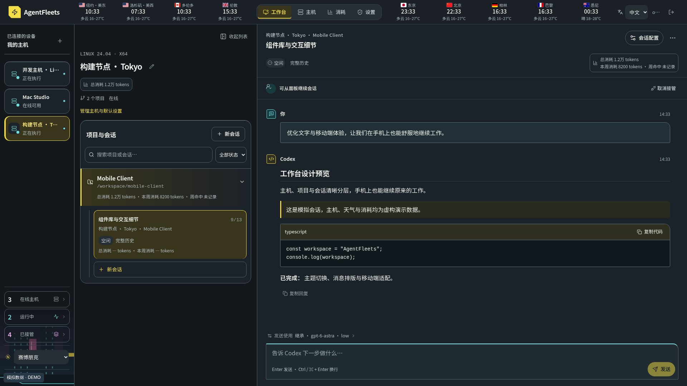](assets/themes/cyber-desktop.jpg)

## 天空之城 · Castle in the Sky

[](assets/themes/daylight-desktop.jpg)

## 黑暗骑士 · The Dark Knight

[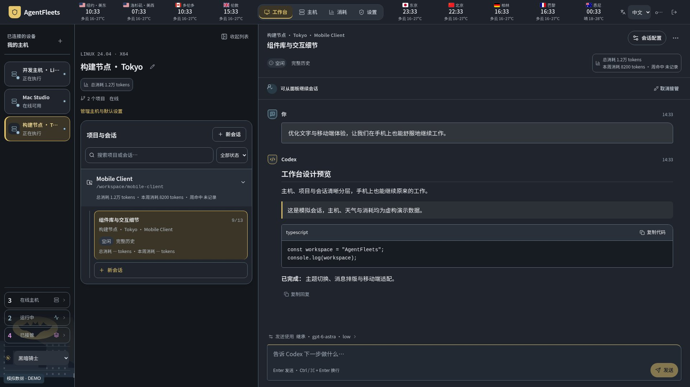](assets/themes/midnight-desktop.jpg)

## 龙猫森林 · Totoro Forest

[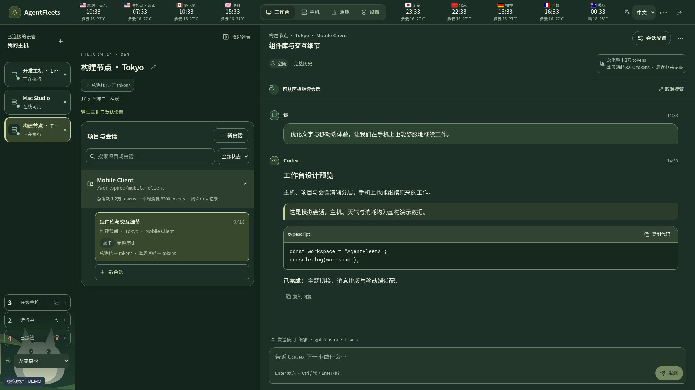](assets/themes/forest-desktop.jpg)

## 彼得兔园 · Peter Rabbit Garden

[](assets/themes/eyecare-desktop.jpg)

## 骇客帝国 · The Matrix

[](assets/themes/matrix-desktop.jpg)

## 冰雪奇缘 · Frozen

[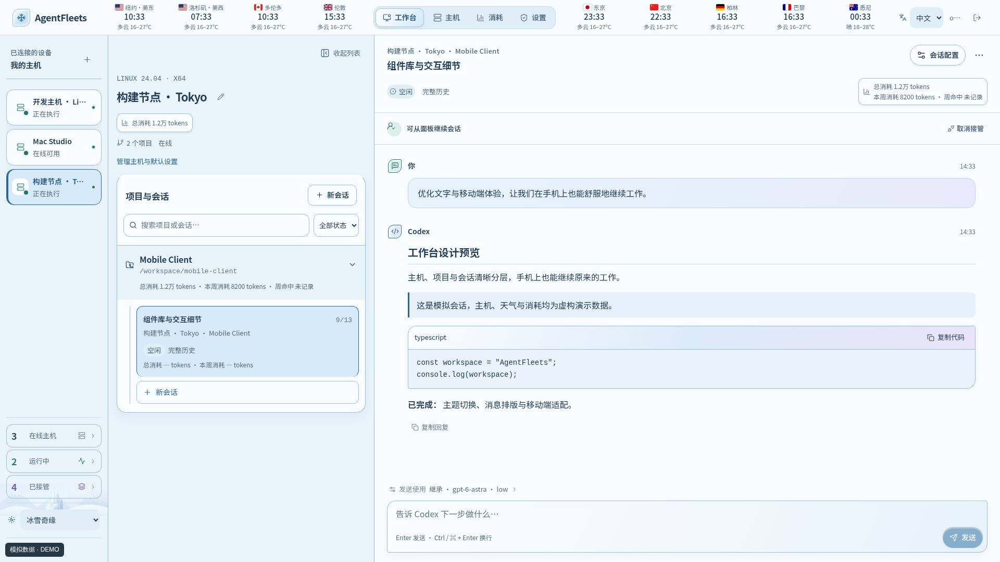](assets/themes/frozen-desktop.jpg)

## 哈利波特 · Harry Potter

[](assets/themes/wizard-desktop.jpg)

## 星球大战 · Star Wars

[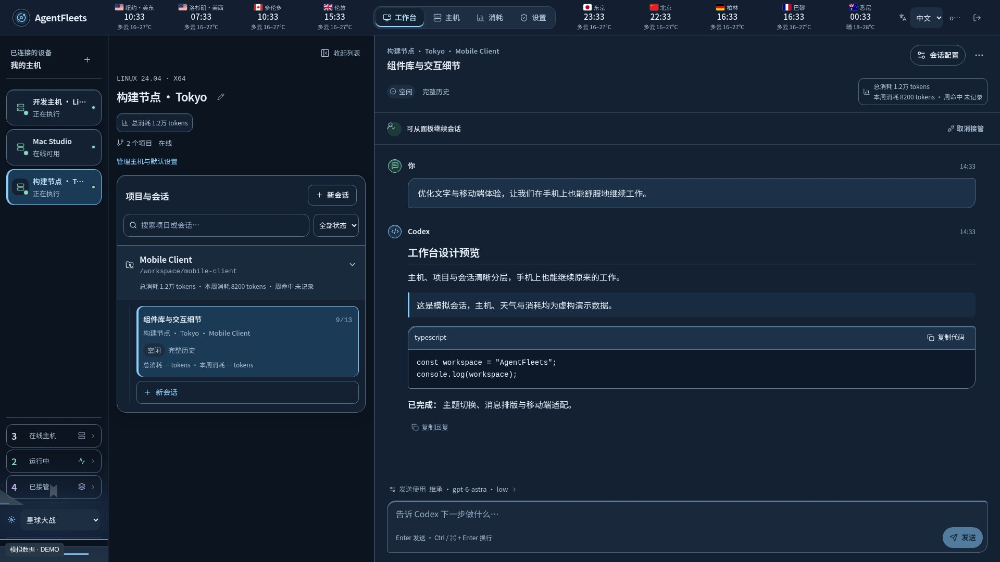](assets/themes/starwars-desktop.jpg)

## 千与千寻 · Spirited Away

[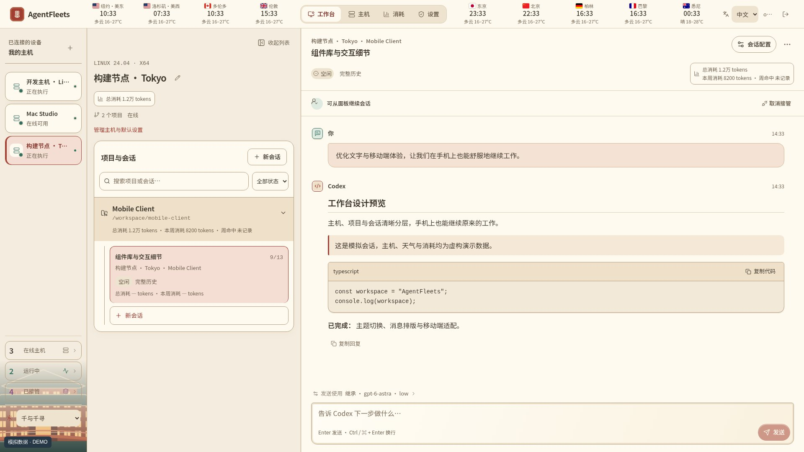](assets/themes/spirited-desktop.jpg)

## 指环王 · The Lord of the Rings

[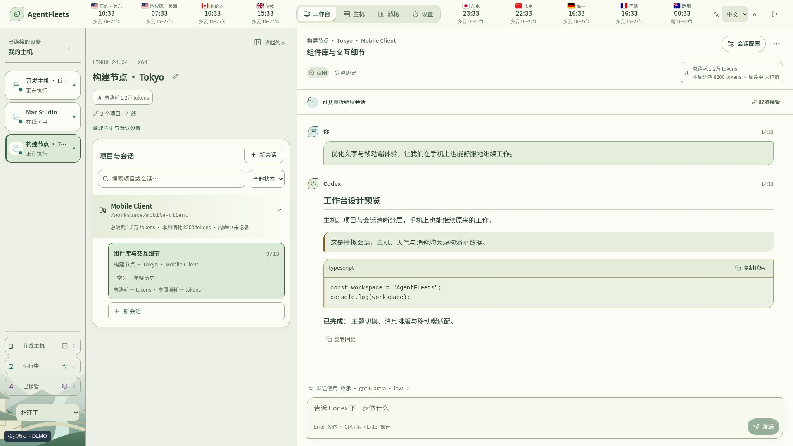](assets/themes/rivendell-desktop.jpg)

## 超级马里奥 · Super Mario

[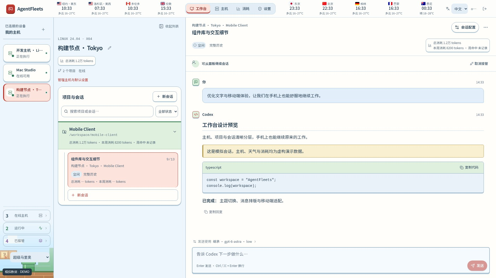](assets/themes/mario-desktop.jpg)

## 大闹天宫 · Havoc in Heaven

[](assets/themes/wukong-desktop.jpg)

## 哪吒闹海 · Nezha Conquers the Dragon King

[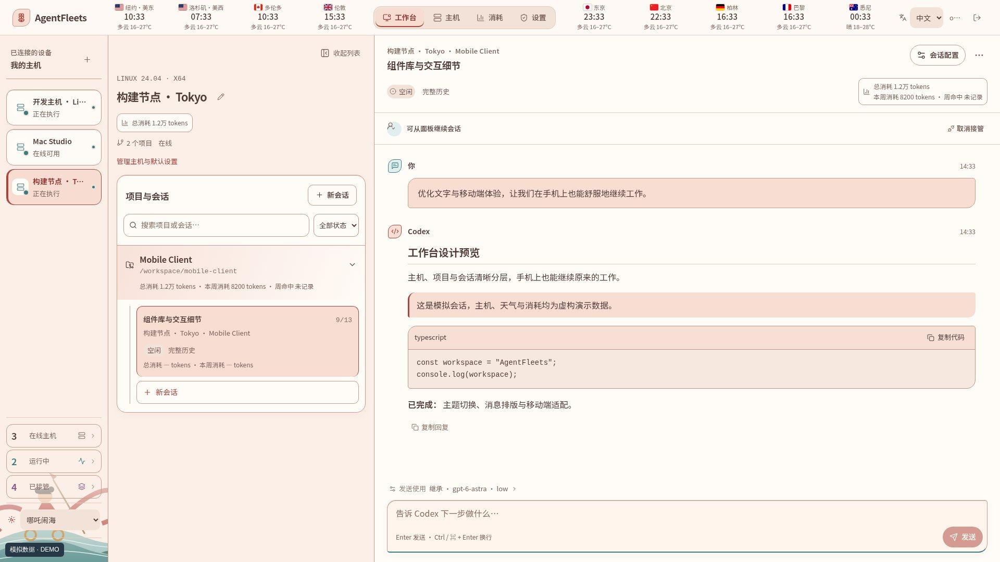](assets/themes/nezha-desktop.jpg)

## 白蛇传说 · Legend of the White Snake

[](assets/themes/whitesnake-desktop.jpg)

## 清明上河 · Along the River

[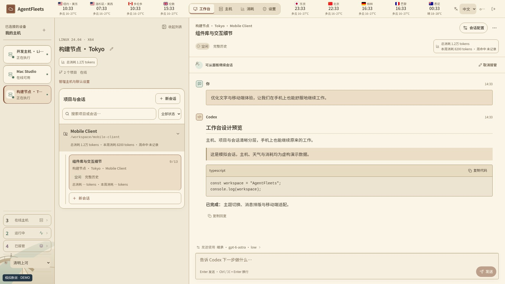](assets/themes/qingming-desktop.jpg)

## 千里江山 · A Thousand Li of Rivers and Mountains

[](assets/themes/jiangshan-desktop.jpg)

## 手机预览 / Mobile previews

| 天空之城 | 骇客帝国 |
| --- | --- |
| [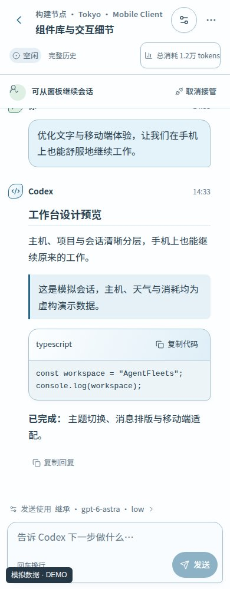](assets/themes/daylight-mobile.jpg) | [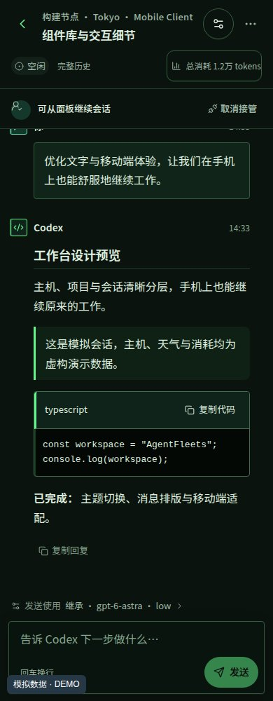](assets/themes/matrix-mobile.jpg) |

| 哈利波特 | 彼得兔园 |
| --- | --- |
| [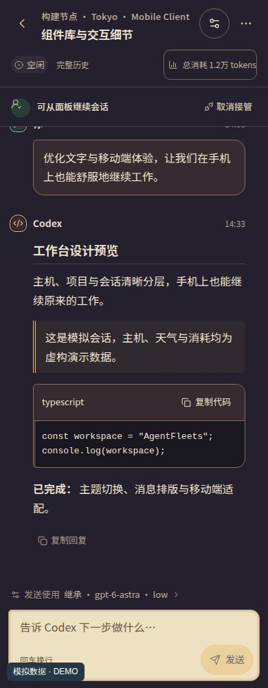](assets/themes/wizard-mobile.jpg) | [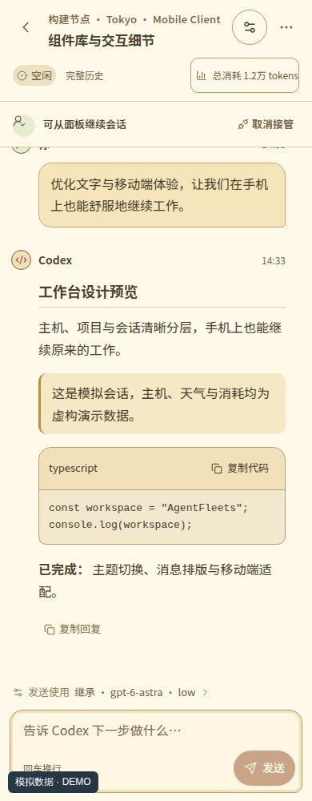](assets/themes/eyecare-mobile.jpg) |

| 白蛇传说 | 千里江山 |
| --- | --- |
| [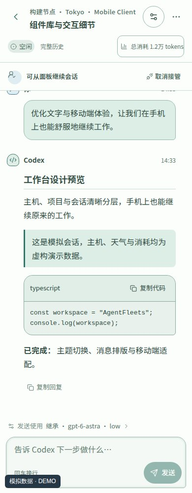](assets/themes/whitesnake-mobile.jpg) | [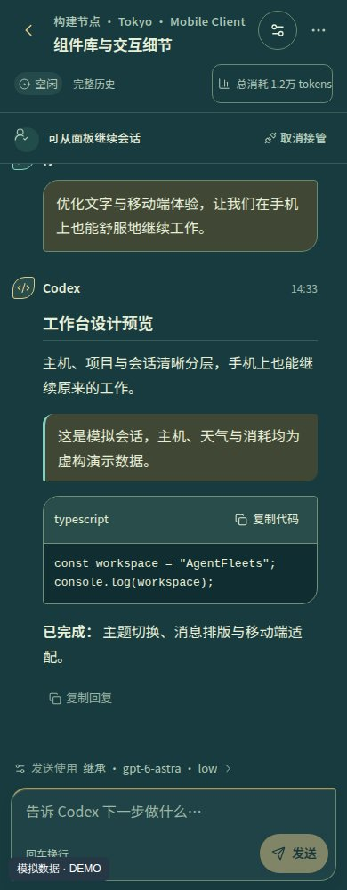](assets/themes/jiangshan-mobile.jpg) |

## 重新生成 / Reproduce

演示数据和截图脚本位于 [screenshots](screenshots)。在本地启动网页开发服务器（端口 22344），通过 Playwright CLI 打开页面，然后依次运行：

```sh
playwright-cli run-code --filename docs/screenshots/demo-fixture.js
playwright-cli run-code --filename docs/screenshots/capture-themes.js
```

The fixture intercepts API and WebSocket traffic in a local preview. It creates no hosts or sessions on a server. The capture script writes 17 desktop and 6 mobile JPEGs to `docs/assets/themes/`. Use a headless Chromium profile appropriate for your local environment. Time labels reflect capture time; fixture identities and messages are fictional.
